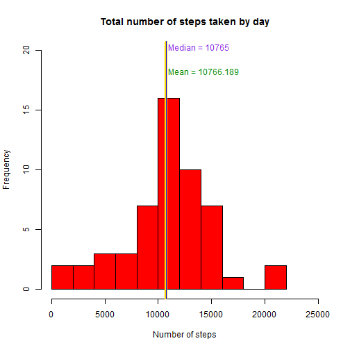
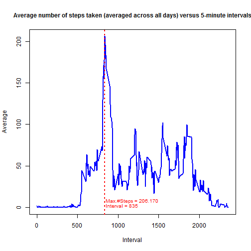
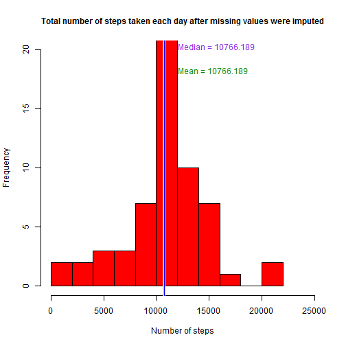
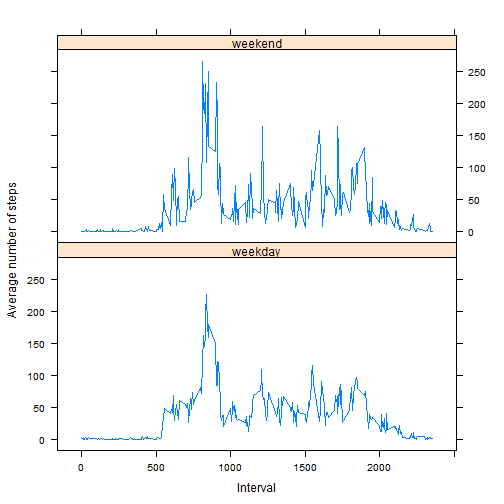

Assignment 1
============

This is an R Markdown document produced to answer the questions formulated by the **Peer Assesment 1**. 

### Loading and preprocessing the data

```r
library(data.table)
library(lubridate)
library(stringr)
datZero <- data.table(read.table("activity.csv", skip = 1, quote = "\"", col.names = c("steps", 
    "date", "interval"), sep = ",", stringsAsFactors = FALSE, colClasses = c("integer", 
    "character", "integer")))
datZero$NewDate <- ymd(datZero$date)

datZero <- datZero[, c("steps", "NewDate", "interval"), with = F]
setnames(datZero, c("steps", "date", "interval"))

```


*****

### Question 1: What is mean total number of steps taken per day?

```r
# Ignoring the missing values
datNotNA <- datZero[!is.na(steps)]
datNotNA <- datNotNA[, `:=`(TotalSteps, sum(steps)), by = date]

datQ1 <- datNotNA[, c("date", "TotalSteps"), with = F]
datQ1 <- unique(datQ1, by = "date")

summary(datQ1)
```

```
##       date                       TotalSteps   
##  Min.   :2012-10-02 00:00:00   Min.   :   41  
##  1st Qu.:2012-10-16 00:00:00   1st Qu.: 8841  
##  Median :2012-10-29 00:00:00   Median :10765  
##  Mean   :2012-10-30 17:12:27   Mean   :10766  
##  3rd Qu.:2012-11-16 00:00:00   3rd Qu.:13294  
##  Max.   :2012-11-29 00:00:00   Max.   :21194
```

```r

meanNotNA <- mean(datQ1$TotalSteps)
medianNotNA <- median(datQ1$TotalSteps)
maxNotNA <- max(datQ1$TotalSteps)

hQ1 <- hist(datQ1$TotalSteps, main = "Total number of steps taken by day", col = "red", 
    xlab = "Number of steps", breaks = 10, xlim = c(0, 25000), ylim = c(0, 20))
abline(v = meanNotNA, col = "gold", lwd = 4)
abline(v = medianNotNA, col = "blue", lwd = 1)

text(medianNotNA + 200, 20, label = paste("Median =", medianNotNA), col = "blueviolet", 
    adj = c(0, 0), cex = 1)

text(meanNotNA + 200, 18, label = paste("Mean =", format(meanNotNA, nsmall = 3)), 
    col = "green4", adj = c(0, 0), cex = 1)
```

 

```r

modeNotNA <- max(hQ1$counts)
modeNotNAInterval <- which(modeNotNA == hQ1$counts)
```

### Answer 1:
-   The mean of the total number of steps taken by day is 10766.189.  

-   The median is 10765.  

-   The mode is 16 and belongs to interval 6.

*****

### Question 2: What is the average daily activity pattern?

```r
datQ2 <- datNotNA[, `:=`(AvgSteps, mean(steps)), by = interval]
datQ2 <- datQ2[, c("interval", "AvgSteps"), with = F]
datQ2 <- unique(datQ2[order(interval)])

maxNumSteps <- max(datQ2$AvgSteps)
rowMaxNumSteps <- which.max(datQ2$AvgSteps)
intervalMaxNumSteps <- datQ2[rowMaxNumSteps][[1]]

with(datQ2, plot(interval, AvgSteps, pch = NA, type = "l", ylab = "Average", 
    xlab = "Interval"))

title(cex.main = 1, main = "Average number of steps taken (averaged across all days) versus 5-minute intervals")
lines(datQ2$interval, datQ2$AvgSteps, col = "blue", lwd = 2)
abline(v = intervalMaxNumSteps, col = "red", lwd = 2, lty = 3)

text(intervalMaxNumSteps + 10, 6, label = paste("Max.#Steps =", format(maxNumSteps, 
    nsmall = 3)), col = "red", adj = c(0, 0), cex = 0.8)

text(intervalMaxNumSteps + 10, 0, label = paste("Interval =", format(intervalMaxNumSteps, 
    nsmall = 3)), col = "red", adj = c(0, 0), cex = 0.8)
```

 

### Answer 2:
-   The maximum number of steps is 206.1698 and it belongs to interval 835.

*****

### Question 3: Imputing missing values

-  The total number of missing values in the dataset has been calculated using the original unprocessed dataset and counting the number of rows where exists at least one column with a value = NA.

-  In order to  filling in all of the missing values in the dataset, the following tasks has been executed:
    -   Calculation of the mean number of steps taken by interval.
    -   Update of the rows where steps=NA with the calculated mean.
-  After filling the missing data, a new dataset with the same structure than the original dataset has been created.

```r
rowsNA <- sum(datZero[, is.na(steps) | is.na(date) | is.na(interval)])

datNA <- datZero[, `:=`(z, mean(steps, na.rm = TRUE)), by = interval]
datNA <- datNA[is.na(steps), `:=`(steps2, z)]
datNA <- datNA[!is.na(steps), `:=`(steps2, steps)]

datQ3 <- datNA[, c("steps2", "date", "interval"), with = FALSE]
setnames(datQ3, c("steps", "date", "interval"))
```

-  A new histogram of the total number of steps taken each day has been generated; 
the mean and median total number of steps taken per day has been incorporated into the graph. 


```r
datQ3 <- datQ3[, `:=`(TotalSteps, sum(steps)), by = date]
datQ3 <- datQ3[, c("date", "TotalSteps"), with = F]
datQ3 <- unique(datQ3, by = "date")

summary(datQ3)
```

```
##       date              TotalSteps   
##  Min.   :2012-10-01   Min.   :   41  
##  1st Qu.:2012-10-16   1st Qu.: 9819  
##  Median :2012-10-31   Median :10766  
##  Mean   :2012-10-31   Mean   :10766  
##  3rd Qu.:2012-11-15   3rd Qu.:12811  
##  Max.   :2012-11-30   Max.   :21194
```

```r

meanNA <- mean(datQ3$TotalSteps)
medianNA <- median(datQ3$TotalSteps)

hQ3 <- hist(datQ3$TotalSteps, main = "", col = "red", xlab = "Number of steps", 
    breaks = 10, xlim = c(0, 25000), ylim = c(0, 20))
title(cex.main = 1, main = "Total number of steps taken each day after missing values were imputed")

abline(v = meanNA, col = "gold", lwd = 4)
abline(v = medianNA, col = "blue", lwd = 1)

text(medianNA + 1300, 20, label = paste("Median =", format(medianNA, nsmall = 3)), 
    col = "blueviolet", adj = c(0, 0), cex = 1)

text(meanNA + 1300, 18, label = paste("Mean =", format(meanNA, nsmall = 3)), 
    col = "green4", adj = c(0, 0), cex = 1)
```

 

```r

modeNA <- max(hQ3$counts)
modeNAInterval <- which(modeNA == hQ3$counts)
```


### Answer 3:
-   The mean of the total number of steps taken by day is 10766.189.

-   The median of the total number of steps taken by day is 10766.189.

-   The impact of imputing missing data on the estimates of the mean and median total daily number of steps is almost null. This effect could be explained by the use of mean values to fill the missing values in the dataset.

-   Nevertheless, the mode is changing to 24 and belongs to interval 6.

*****

### Question 4: Are there differences in activity patterns between weekdays and weekends?


```r
datQ4 <- datNA[, c("steps2", "date", "interval"), with = FALSE]
setnames(datQ4, c("steps", "date", "interval"))
datQ4 <- datQ4[, `:=`(TotalSteps, sum(steps)), by = date]

WeekDay <- c("Monday", "Tuesday", "Wednesday", "Thursday", "Friday")
WeekEndDay <- c("Saturday", "Sunday")

datWeek <- datQ4[weekdays(datQ3$date) %in% WeekDay]
datWeekend <- datQ4[weekdays(datQ3$date) %in% WeekEndDay]

datWeek <- datWeek[, `:=`(meanSteps, mean(steps)), by = interval]
datWeekend <- datWeekend[, `:=`(meanSteps, mean(steps)), by = interval]

datWeek <- datWeek[, `:=`(DayType = "weekday")]
datWeekend <- datWeekend[, `:=`(DayType = "weekend")]

meanWeek <- mean(datWeek$meanSteps)
meanWeekend <- mean(datWeekend$meanSteps)

medianWeek <- median(datWeek$meanSteps)
medianWeekend <- median(datWeekend$meanSteps)

library(lattice)
datQ4 <- merge(datWeek, datWeekend, by = names(datWeek), all = TRUE)
datQ4 <- datQ4[order(interval, DayType)]
with(datQ4, xyplot(meanSteps ~ interval | DayType, layout = c(1, 2), type = "l", 
    xlab = "Interval", ylab = "Average number of steps"))
```

 


### Answer 4:
-   There are some differences between the activity patterns: 
    -   Mean average number of steps for weekdays is 37.05.
    -   Mean average number of steps for weekends is 38.33.
    -   Median average number of steps for weekdays is 31.33.
    -   Median average number of steps for weekends is 26.23.


*****

